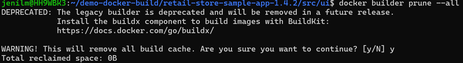
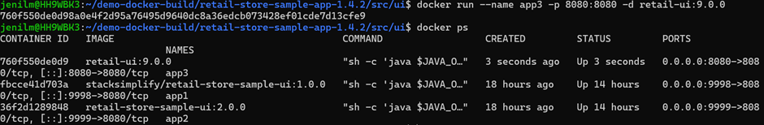
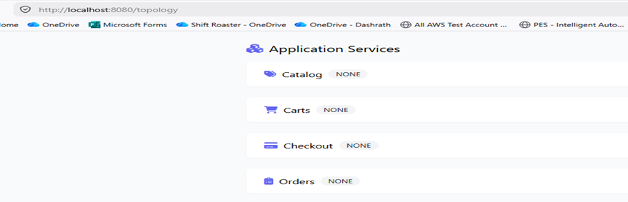
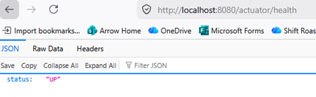
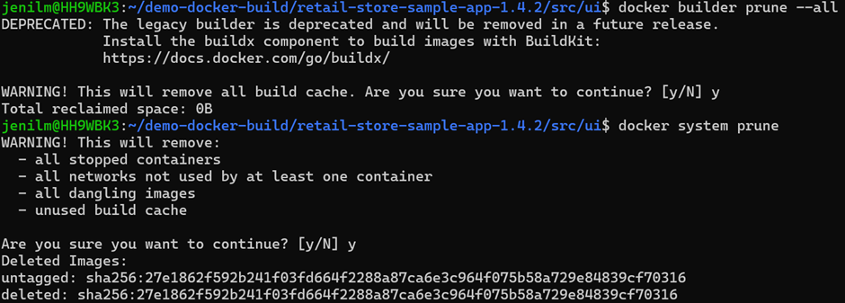
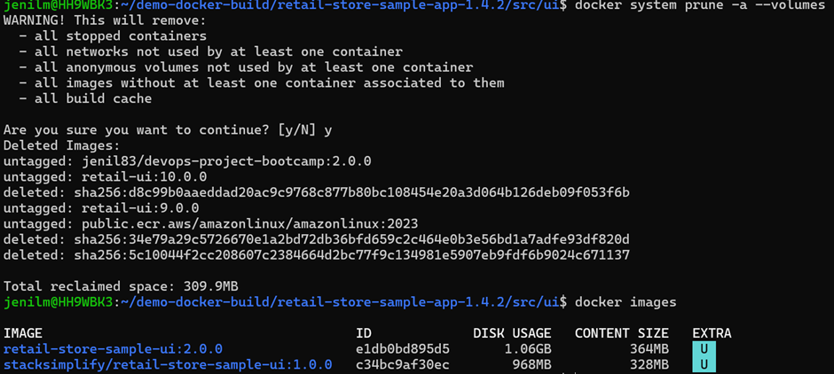

## Introduction

* Retail store microservices application
* Multi-Container Application – 5 microservices, 3 DBs, 1 cache server, 1 messaging server
* Self-hosted persistent dataplane on AWS EKS cluster
* Multi-stage docker builds
* AWS VPC with public and private subnets
* Precedence of terraform variables
* Terraform remote state datasource
* EKS Pod Identity Agent (PIA), Kubernetes storage, AWS EBS volumes for EKS workloads
* AWS Secrets Manager for EKS workloads + RDS MySQL DB
* AWS Load Balancer Controller install on AWS EKS
* Helm – Kubernetes package manager
* Load balancers & DNS
* Spot nodepool + interruption handling + pod disruption budget
* Horizontal Pod Autoscaler (HPA)
* EKS cluster + metrics server using Terraform
* ADOT - AWS Distro for Open Telemetry
* AWS DevOps CI/CD: GitOps pipeline
* What is ArgoCD?

---

## Section 1: Retail Store Project Introduction

* 5 microservices, 3 DBs, 1 cache server, 1 messaging server
* Total 10 containers

---

## Section 2: Docker Commands

### Docker on Amazon Linux 2023

```bash
sudo dnf update -y
sudo dnf install docker -y
sudo systemctl enable docker
sudo systemctl start docker
sudo usermod -aG docker ec2-user
```

### Local (WSL / Ubuntu)

```bash
sudo apt update
sudo apt install docker.io
docker --version
sudo usermod -aG docker $USER
newgrp docker
sudo service docker start
```

Screenshot:


---

## Docker Basic Commands

```bash
docker images
docker ps
docker ps -a
docker ps -aq
docker rm $(docker ps -aq)
docker images -q
docker rmi $(docker images -q)
```


---

## Check Docker Version

```bash
docker version
```

---

## Pull Docker Image

```bash
docker pull stacksimplify/retail-store-sample-ui:1.0.0
```
### Alternatively (GitHub Packages)

```bash
docker pull ghcr.io/stacksimplify/retail-store-sample-ui:1.0.0
```

---

## Run Docker Container

```bash
docker run --name app1 -p 8888:8080 -d stacksimplify/retail-store-sample-ui:1.0.0
```

* `-d` → detach mode
* `8080` → container port
* `8888` → host port

Screenshot:

---

## Application Output

Open in browser:

```
http://localhost:8888
```

Screenshot:

---

## Execute Commands Inside Container

```bash
docker exec -it app1 /bin/sh
docker exec -it app1 ls
docker exec -it app1 env
```

Screenshot:


---

## Container Management

```bash
docker stop app1
docker start app1
docker rm app1
docker rmi <image-id>
```


---

## Build Docker Image

```bash
docker login
mkdir demo-docker-build
cd demo-docker-build
wget https://github.com/aws-containers/retail-store-sample-app/archive/refs/tags/v1.4.2.zip
unzip v1.4.2.zip
```


---

## Modify Application Code

```bash
sed -i 's/Secret Shop<\/span>/No more Secret Shop<\/span>/' home.html
grep 'Secret Shop' home.html
```

---

## Build Docker Image

```bash
docker build -t retail-store-sample-ui:2.0.0 .
```

Screenshot:


---

## Tag and Push to Docker Hub

```bash
docker tag retail-store-sample-ui:2.0.0 <username>/devops-project-bootcamp:2.0.0
docker push <username>/devops-project-bootcamp:2.0.0
```

Screenshots:


### Before Change


### After Change


---

---
## Introduction to Dockerfile

* Multi-stage Dockerfile
* Create a non-root user to secure container
* Use `.dockerignore` to exclude unnecessary files
* Layer caching for faster builds
* Use `docker exec` to access running container
* Rebuild image from scratch using `--no-cache`

---

## Dockerfile Basics

* **FROM** → Base image to build from
* **RUN** → Execute commands during image build (install packages)
* **VOLUME** → Create mount point for persistent/shared data (e.g., `/tmp`)
* **WORKDIR** → Set working directory inside container
* **COPY** → Copy files from host to image
* **ENV** → Set environment variables
* **USER** → Run container as non-root user (security best practice)
* **EXPOSE** → Define container port
* **ENTRYPOINT** → Default command when container starts

---

## Multi-Stage Docker Builds

### Build Stage

* Contains:

  * Source code
  * Build tools (e.g., Maven)
  * Packages (`which`, `tar`, `gzip`)
* Purpose:

  * Compile/build application
* Note:

  * Not included in final image

---

### Package Stage (Final Image)

* Contains:

  * Runtime environment (JDK + app.jar)
* Does NOT contain:

  * Build tools
  * Source code
  * Extra packages
* Benefits:

  * Lightweight
  * Faster
  * More secure
  * Production-ready

---

## Docker Build Cache Cleanup

```bash
docker builder prune --all
```

---

## Build and Run Docker Image

```bash
docker build -t retail-ui:9.0.0 .
docker run --name app3 -p 8080:8080 -d retail-ui:9.0.0
```



---

## Access Running Container

```bash
docker exec -it app3 sh
```

---

## Rebuild Image Without Cache

```bash
docker build --no-cache -t retail-ui:10.0.0 .
```

---

## Docker Cleanup Commands

### Remove Build Cache

```bash
docker builder prune
docker builder prune -f
docker builder prune --all
```

---

### Remove Unused Resources

```bash
docker system prune
docker system prune --volumes
docker system prune -a --volumes
```

---

### What `docker system prune -a --volumes` removes:

* All stopped containers
* All unused networks
* All anonymous volumes not used by containers
* All unused images (no container attached)
* All build cache

---

## Summary

* Installed Docker locally and on EC2
* Pulled and ran container
* Accessed application on browser
* Executed commands inside container
* Built custom Docker image
* Tagged and pushed image to Docker Hub
* Understood Dockerfile basics (FROM, RUN, COPY, ENV, USER, ENTRYPOINT)
* How to used non-root user for improved container security
* Leveraged Docker layer caching for faster builds
* Rebuilt images using `--no-cache` option
* Cleaned up unused Docker resources using prune commands