# Kubernetes Ingress

## Ingress vs Service Load Balancer

### AWS ALB

* Works with Kubernetes Ingress
* Handles:

  * HTTP
  * HTTPS traffic
* Operates at:

  * OSI Layer 7

---

### AWS NLB

* Works with Kubernetes Service type `LoadBalancer`
* Handles:

  * TCP traffic
* Operates at:

  * OSI Layer 4

---

# Features of Kubernetes Ingress

## Path-Based Routing

Routes traffic based on URL path.

Example:

```text id="h7a1pb"
/catalog -> catalog-service
/cart -> cart-service
```

---

## Hostname-Based Routing

Routes traffic based on domain name.

Example:

```text id="n2e4cv"
catalog.example.com
cart.example.com
```

---

## Header-Based Routing

Routes traffic using HTTP headers.

---

# AWS Load Balancer Controller (LBC)

## Why AWS LBC?

* Kubernetes Ingress alone cannot create AWS ALB
* AWS Load Balancer Controller acts as bridge between:

  * Kubernetes
  * AWS Elastic Load Balancer

---

# Download IAM Policy

```bash id="w4qv7f"
curl -o aws-load-balancer-controller-policy.json \
https://raw.githubusercontent.com/kubernetes-sigs/aws-load-balancer-controller/main/docs/install/iam_policy.json
```

---

# Create IAM Role for LBC

## Create Trust Policy

* Create trust policy JSON file

---

## Create IAM Role

```bash id="s7y9xn"
aws iam create-role \
  --role-name AmazonEKS_LBC_Role_${EKS_CLUSTER_NAME} \
  --assume-role-policy-document file://aws-load-balancer-controller-trust-policy.json
```

---

## Attach IAM Policy

```bash id="m8h3tl"
aws iam attach-role-policy \
  --role-name AmazonEKS_LBC_Role_${EKS_CLUSTER_NAME} \
  --policy-arn arn:aws:iam::<aws-account-id>:policy/AWSLoadBalancerControllerIAMPolicy_${EKS_CLUSTER_NAME}
```

---

## Verify Attached Policies

```bash id="w7pr2x"
aws iam list-attached-role-policies \
  --role-name AmazonEKS_LBC_Role_${EKS_CLUSTER_NAME}
```

---

# Install AWS Load Balancer Controller using Helm

## Add Helm Repository

```bash id="h1xt4v"
helm repo add eks https://aws.github.io/eks-charts
helm repo update
```
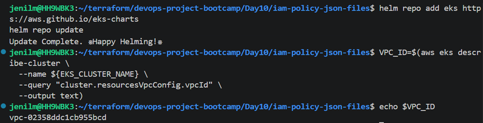
---

## Install Controller

```bash id="r9dk4m"
helm install aws-load-balancer-controller eks/aws-load-balancer-controller \
  -n kube-system \
  --set clusterName=${EKS_CLUSTER_NAME} \
  --set region=${AWS_REGION} \
  --set vpcId=${VPC_ID} \
  --set serviceAccount.create=true \
  --set serviceAccount.name=<service-account-name>
```
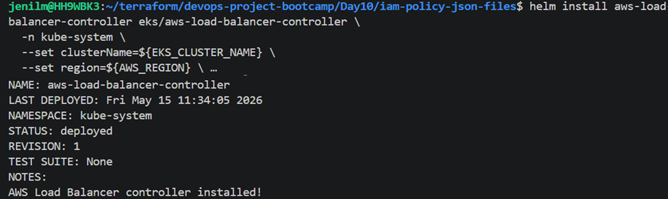
---

## Verify Helm Installation

```bash id="r7gx0f"
helm list -n kube-system
helm status aws-load-balancer-controller -n kube-system
```

---

## Verify Controller Deployment

```bash id="k5vw0q"
kubectl get pods -n kube-system -l app.kubernetes.io/name=aws-load-balancer-controller
```
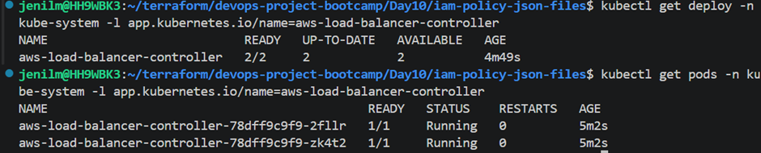
---

# Kubernetes NodePort Service

## What is NodePort?

* Opens static port on every worker node
* Allows external traffic access to application

### NodePort Range

```text id="t2e9gr"
30000 - 32767
```

---

# How Ingress Works

```text id="lj5drf"
User -> ALB -> Service -> Pods
```
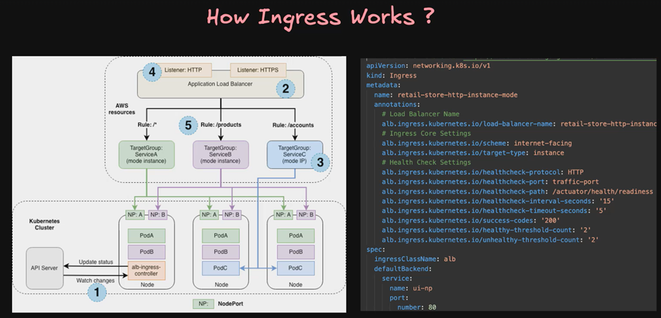
---

# Kubernetes Annotations

## What are Annotations?

* Extra metadata attached to Kubernetes objects
* Used for:

  * Configuration
  * Controller behavior
  * Integration settings

---

# Labels vs Annotations

## Labels

* Used to identify/select Kubernetes objects

## Annotations

* Used to store additional metadata/information

---

# Ingress Components

## Target Group

Maps traffic to:

* ClusterIP Service
* NodePort Service

---

## Listeners

* Listen on ports:

  * 80 (HTTP)
  * 443 (HTTPS)

---

## Routing Rules

* Define how traffic should route to services

---

# Ingress Modes

# Instance Mode

## Flow

```text id="2xrrdz"
User -> ALB -> NodePort -> Pod
```

## Target Group

```text id="xvsczj"
worker-node-ip:nodeport
```

## Notes

* Default mode
* ALB sends traffic to NodePort service

---

# IP Mode

## Flow

```text id="pzzymg"
User -> ALB -> Pod
```

## Target Group

```text id="v2p5fj"
Pod IP Address
```

## Benefits

* Better performance during high traffic
* Direct pod targeting

---

## Requirement for IP Mode

* AWS VPC CNI plugin must be installed

### Verify AWS VPC CNI

```bash id="gf6z9r"
kubectl describe ds aws-node -n kube-system | grep Image
```
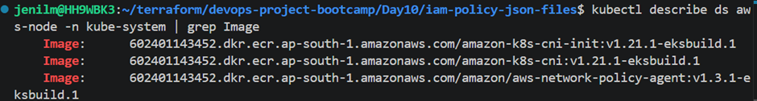
---

# Verify IngressClass

```bash id="e5pbvw"
kubectl get ingressclass
```
* Default ingress class is usually `alb`
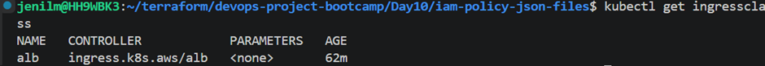
---

# Verify Pods

```bash id="jz9z1m"
kubectl get pods
```
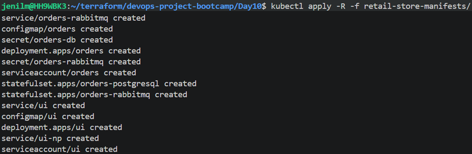

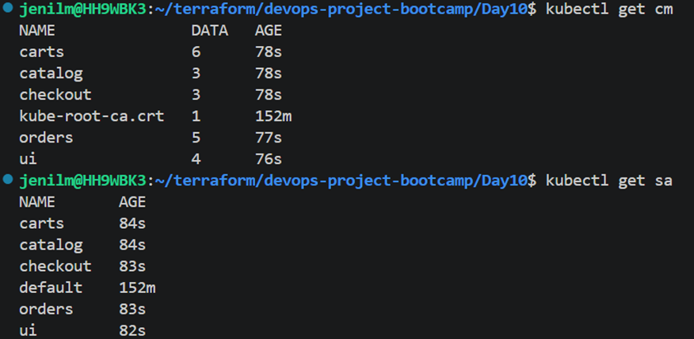

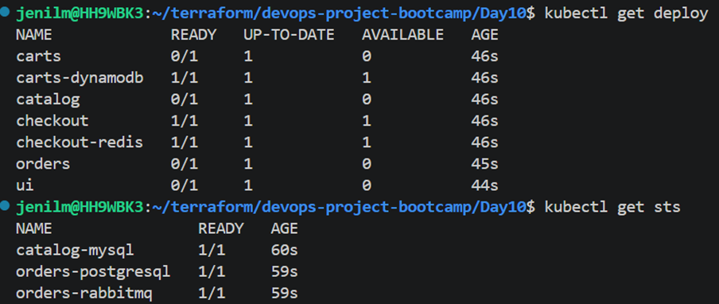

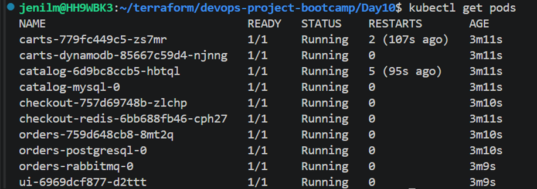

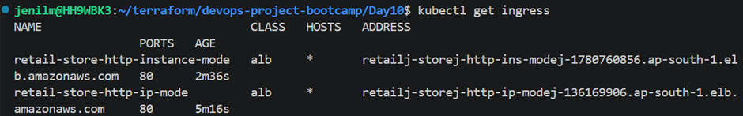

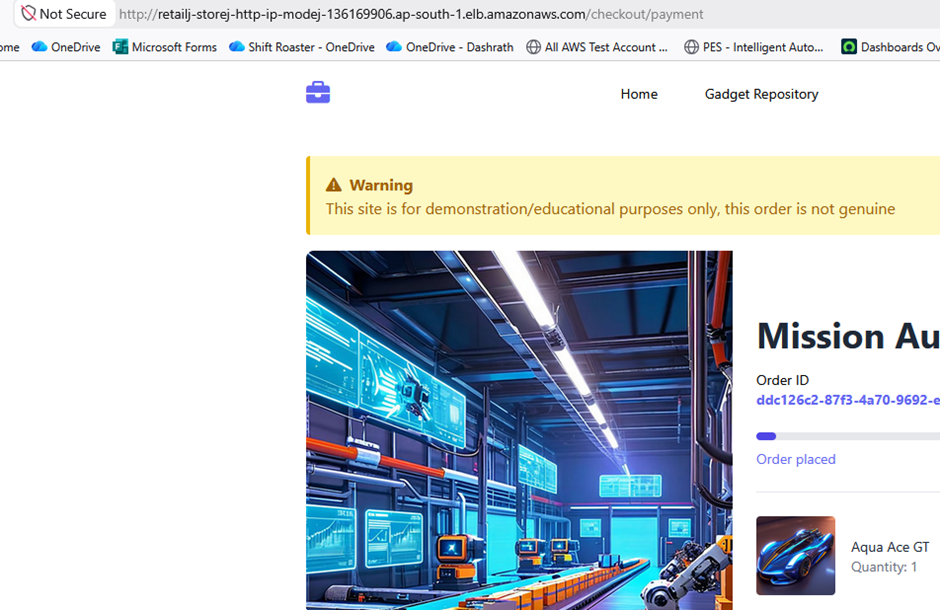

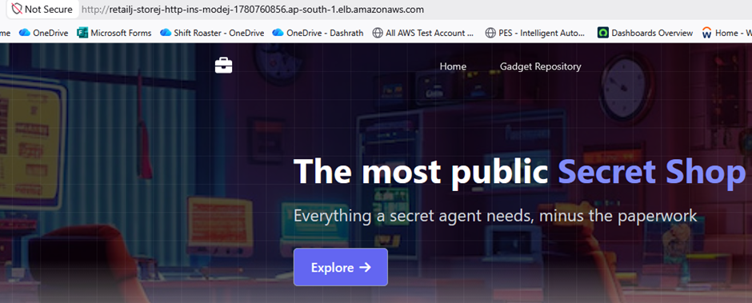
---

# Kubernetes Ingress HTTPS

## HTTPS Setup Components

### ACM Certificate

* Used for SSL/TLS certificates

### Route53

* Used for DNS management

---

## Steps

1. Create ACM certificate
2. Configure Route53 DNS
3. Deploy HTTPS ingress resource

---
