## Git Long Path Fix

```bash
git config --system core.longpaths true
```

---

## Multi-Container Application

### Docker Compose

* Simplified orchestration for microservices
* Handles dependencies, health checks, centralized config

### Basic Commands

```bash
docker compose up
docker compose up -d
docker compose down
```

---

## Docker Compose File Structure

* **networks** → defined at root level, shared by all containers
* **services** → container configurations

### Common Service Options

* `cap_add`, `cap_drop` (security)
* `healthcheck`
* `networks`
* `read_only`
* `restart`
* `security_opt`
* `tmpfs`

---

## Example: Cart Service

* `cap_add`: net_bind_service (<1024)
* `depends_on`: carts_db (condition: service_healthy)
* `environment`
* `healthcheck`: interval, retries, start_period, test, timeout
* `ports`: mode, protocol, published, target

---

## Install Docker Compose

```bash
docker compose version
sudo mkdir -p /usr/local/lib/docker/cli-plugins
wget https://github.com/docker/compose/releases/latest/download/docker-compose-linux-x86_64 -O docker-compose
chmod +x docker-compose
sudo mv docker-compose /usr/local/lib/docker/cli-plugins/docker-compose
```

---

## Run Compose File

```bash
docker compose up
docker compose up -d
docker compose -f abc.yaml up
```
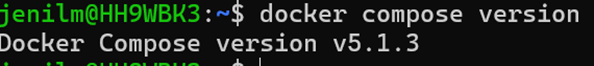

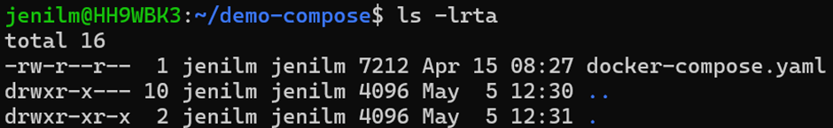
---

## Common Fix

If error:

```
failed to resolve reference / connection timed out
```

```bash
docker logout
docker login
```
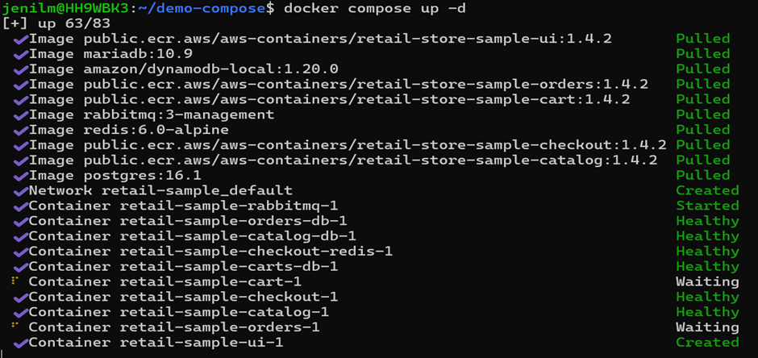
---

## Access Application

```
http://localhost:8888/topology
```
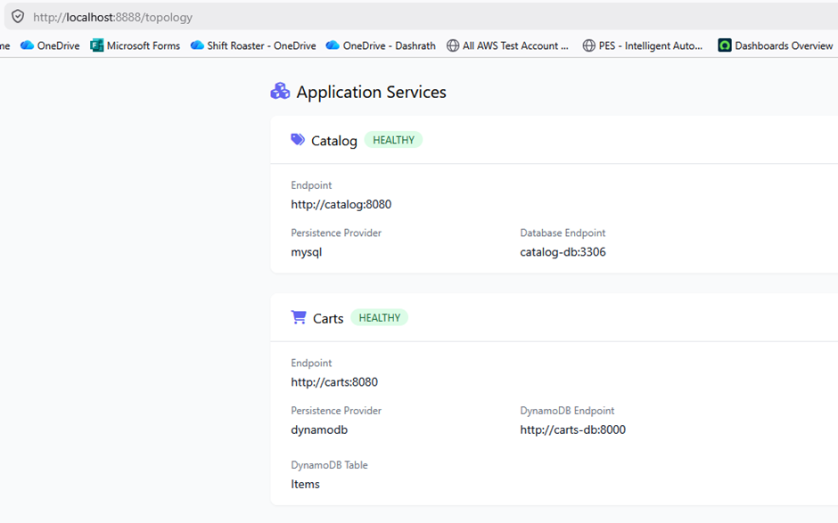
---

## Manage Services

```bash
docker compose ps
docker compose ps -a
docker compose stop orders
docker compose start orders
docker compose restart orders
```
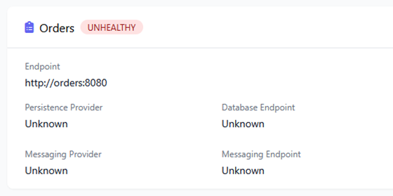
---

## Logs

```bash
docker compose logs
docker compose logs checkout
docker compose logs -f checkout
```
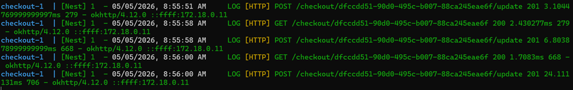

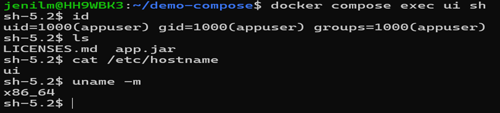
---

## Monitoring

```bash
docker compose stats
docker compose top
```
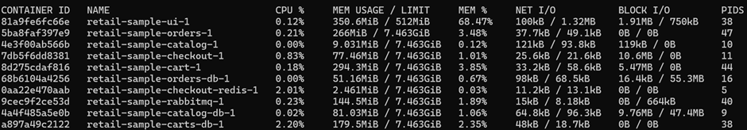

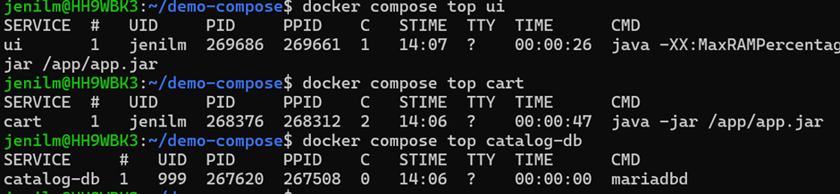
---

## Recreate Container

```bash
docker compose exec ui env
docker compose up -d --force-recreate ui
```
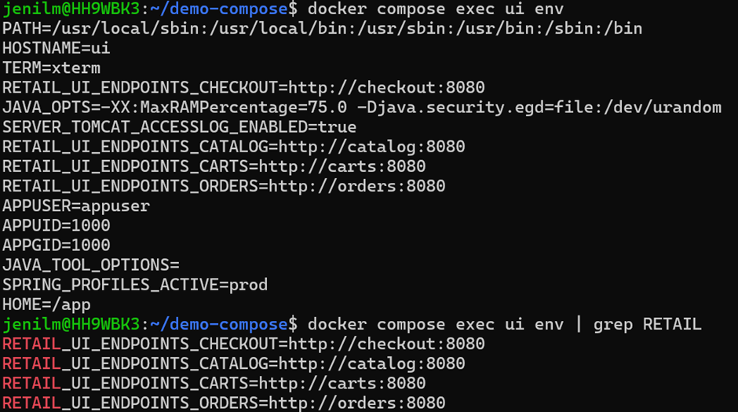

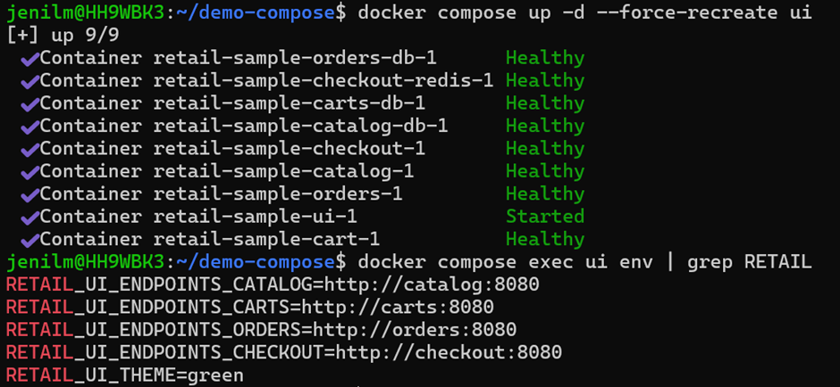


---

## Stop All

```bash
docker compose down
```
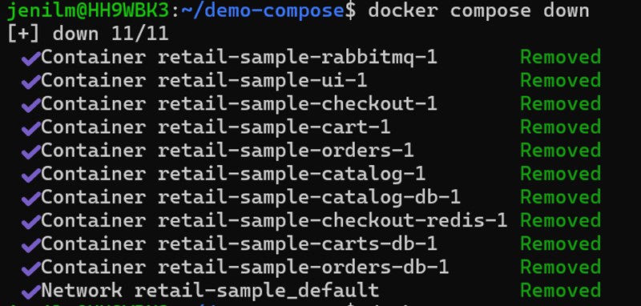
---

## Multi-Platform Docker Images

* Use when image built on `amd64` but needed on `arm64`
* Uses Docker Buildx + QEMU

---

## Install QEMU

```bash
docker run --privileged --rm tonistiigi/binfmt --install all
```

---

## Setup Buildx

```bash
docker buildx ls
docker buildx create --name multiarch --driver docker-container --use
docker buildx inspect --bootstrap
```
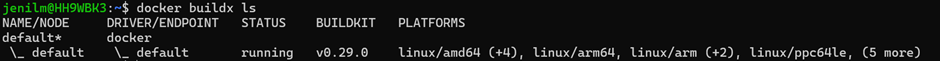

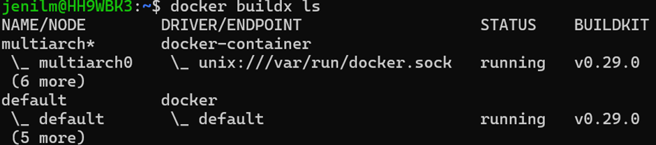
---

## Docker Hub Variables

```bash
export DOCKERHUB_USER="jenil83"
export DH_REPO="retail-ui-multiarch"
export TAG="1.0.0"
export IMAGE="${DOCKERHUB_USER}/${DH_REPO}:${TAG}"
echo $IMAGE
docker login -u "${DOCKERHUB_USER}"
```

---

## Build & Push Multi-Arch Image

```bash
DOCKER_BUILDKIT=1 docker buildx build \
  --platform linux/amd64,linux/arm64 \
  -t "${IMAGE}" \
  --push .
```
### Look for entries for linux/amd64 and linux/arm64
-docker buildx imagetools inspect "${IMAGE}"

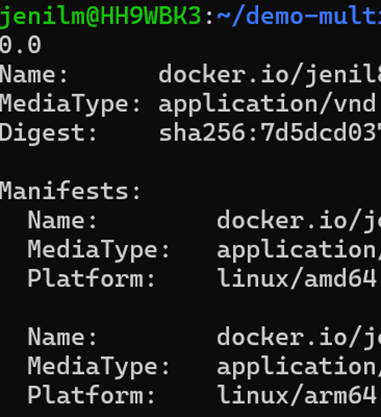

-AMD64: Run and test the containers
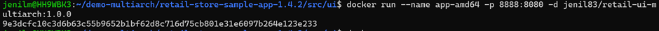

# v2 version
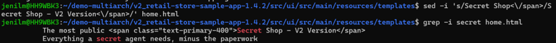

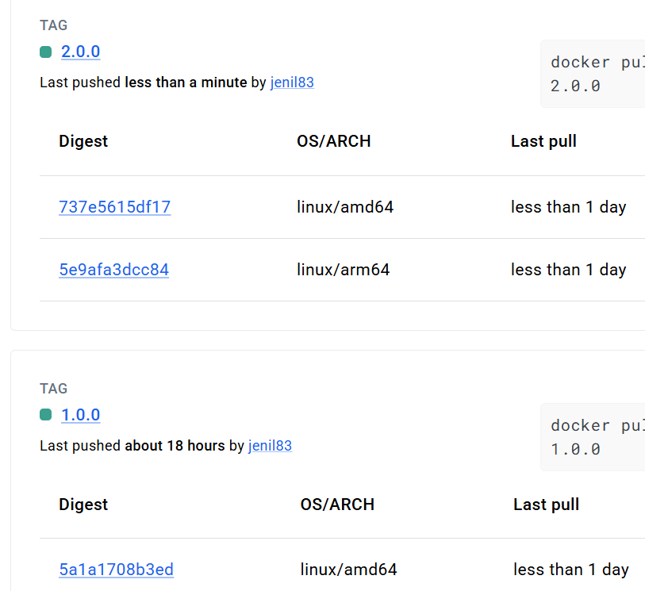

## To check cache size
- docker system df

---
