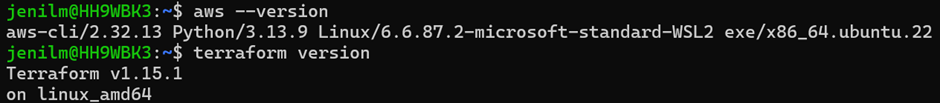
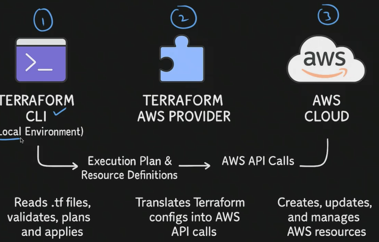
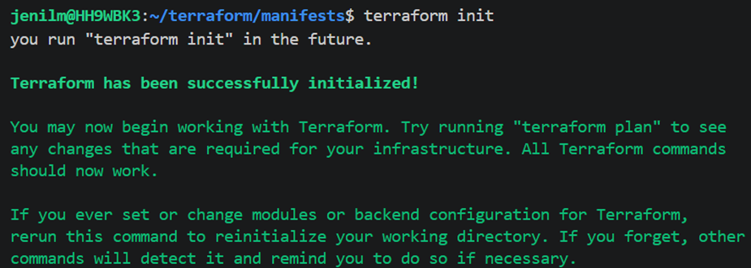
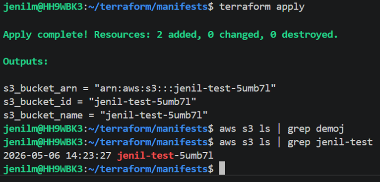
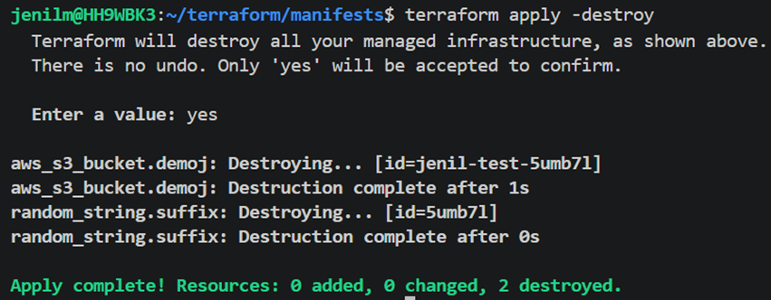
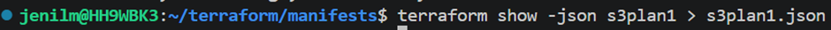
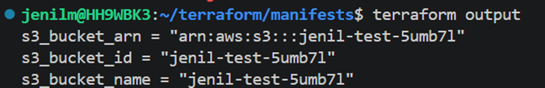
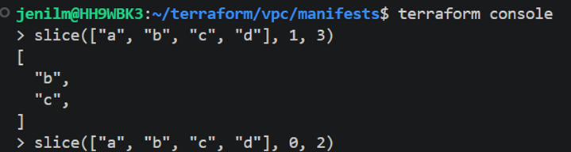
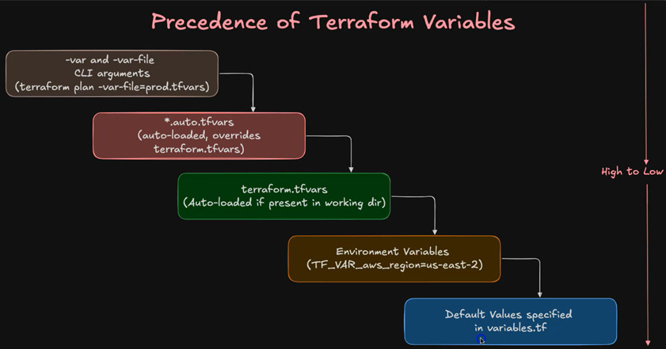

## Terraform

### Traditional Ways

* Manual setup
* Scripts (Bash, Python, AWS CLI)
* AWS CloudFormation

---

### Why Terraform

* Consistency across environments
* Reusable code
* Collaboration
* Predictability
* Scalability
* Portability

---

## Installation

* Terraform CLI
* AWS CLI + Access Keys
* VS Code
* VS Code Terraform Extension (autocomplete)

```bash id="u6tqfp"
sudo dnf install -y dnf-plugins-core
```

---

## Terraform Blocks

* **terraform block**
* **provider block**
* **resource block**
* **output block**


---

## Working Directory

* All Terraform configuration files should be in one directory

---

## Terraform Init

```bash id="m0o9xm"
terraform init
```

* Downloads provider plugins
* Creates `.terraform/` directory
* Creates `terraform.lock.hcl` (commit to version control)

---

## Terraform Block

* Foundation block of configuration
* `required_version` → prevents compatibility issues
* `required_providers` → defines providers

```hcl id="hv0j5q"
~>  (recommended: allow minor updates, avoid major upgrades)
```

---

## Provider Block

* Defines cloud provider (e.g., AWS)
* Must match `required_providers`
* Handles authentication via parameters or environment variables

---

## Resource Concepts (S3 Example)

* **Argument Reference** → input configuration before resource creation
* **Attribute Reference** → output values after resource creation

---

## Terraform Commands

```bash id="k9b8q3"
terraform validate
terraform plan
terraform apply
terraform output
terraform destroy
terraform apply -destroy
```





---

## Plan Output

```bash id="q2dycz"
terraform plan -out=s3plan1
terraform show
terraform show -json s3plan1 > s3plan1.json
```

---

## VPC Concepts

### Data Block

* Reads data from existing resources

### Locals Block

* Assign reusable values

---

## Functions

### Slice Function

```hcl id="z6hj6o"
slice(list, startindex, endindex)
```

### CIDR Subnet

```hcl id="p0qk6t"
cidrsubnet(prefix, newbits, netnum)
```

### Merge Function

* Combines multiple maps into one

---

## Terraform Console

```bash id="k6b4sa"
terraform console
```

* Used to test functions

---

## Meta Arguments

* `depends_on`
* `count`
* `for_each`
* `provider`
* `providers`
* `lifecycle`

---

## Variable Precedence

* Terraform variables follow a defined precedence order


---
