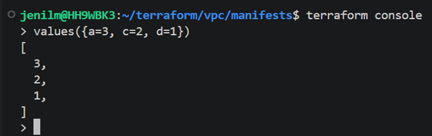
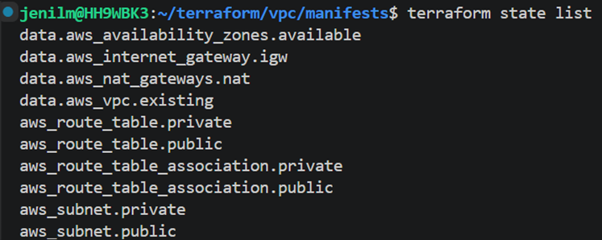
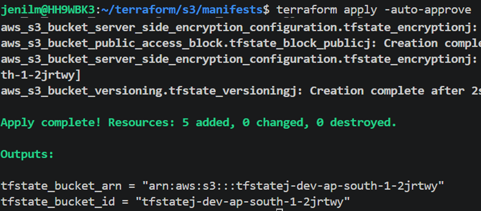
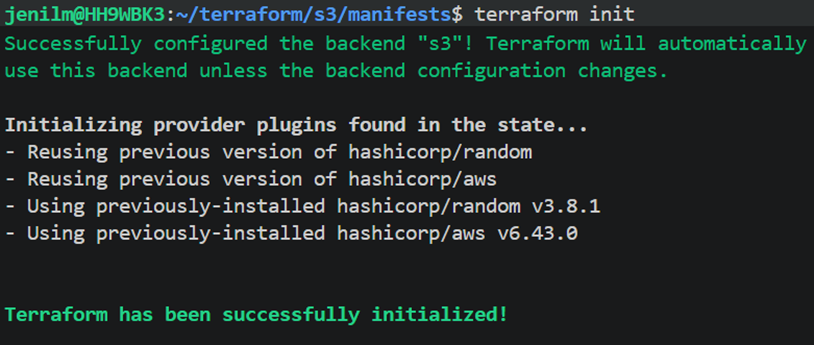
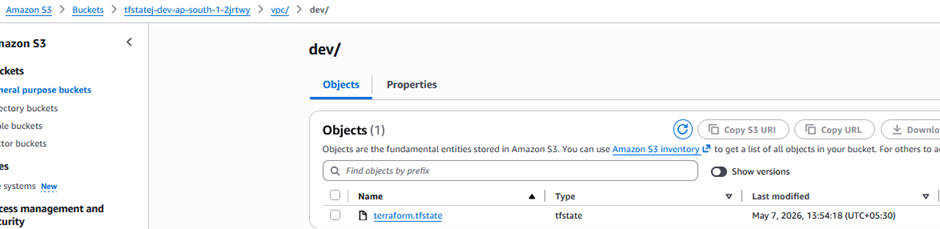

## Terraform Functions

### Values Function

* Extracts values from a map and returns them as a list

---

## Terraform State File

### Local State File

* Default state storage method
* Stored in working directory as:

```id="i4q2la"
terraform.tfstate
```

### Remote State File

* State stored remotely (recommended for production)

---

## Terraform Drift

* Difference between actual infrastructure and Terraform state/configuration

---

## Terraform State List

```bash id="h7pn4f"
terraform state list
```

---

## Set Environment Variables

```bash id="r5nyg6"
export TF_VAR_environment_name="predev"
export TF_VAR_aws_region="us-east-1"
echo env | grep TF_
```

---

## Terraform Variable Commands

```bash id="ydj2ie"
terraform plan -var-file=file_name
terraform plan -var="key=value"
```

### Variable Precedence

* If both `-var-file` and `-var` are used,
  the last value on command line takes precedence

---

## Remote S3 Backend

### Challenges with Local State File

* Collaboration issues
* No versioning
* No state locking
* Security concerns

---

## Terraform Remote State File

### Benefits

* Safe
* Consistent
* Production-ready

### Backend Storage

* AWS S3 Bucket



### Important Note

* Variables cannot be used directly in backend block

```hcl id="s1mx6k"
var.region ❌
```

---

## State Locking

* During `terraform plan` and `terraform apply`, state file gets locked

---

## Terraform Modules

### Definition

* Reusable container of Terraform resources

### Root Module

* Every Terraform configuration starts with a root module

---

## Module Storage Options

### Local File System

* Local directory
* Shared file system

### Public Registry

* `terraform.registry.io`
* GitHub modules

### Private Registry

* HCP Terraform (Cloud)
* Terraform Enterprise

---

## Module Outputs

* Outputs from child module must be passed to root/main module

---
