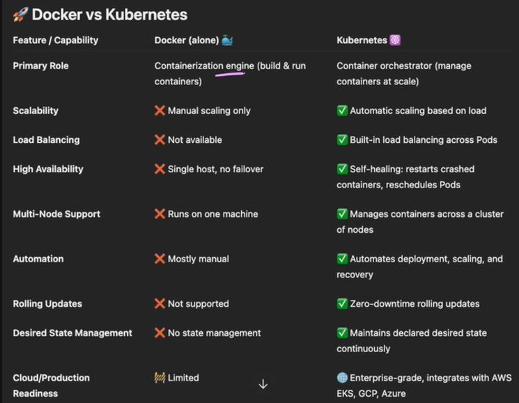
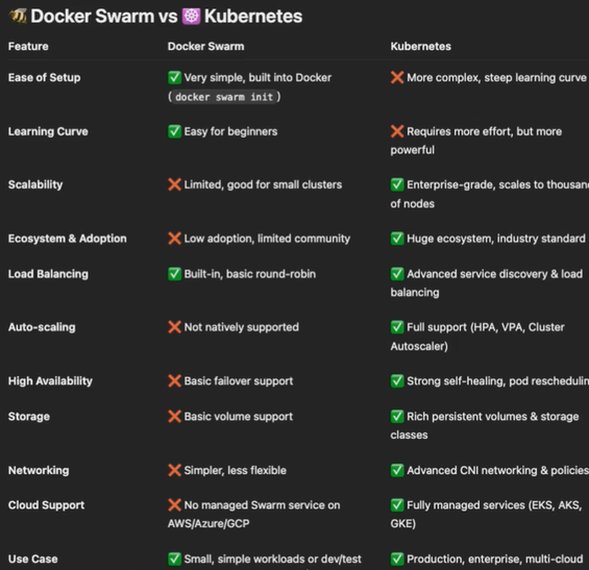

## Kubernetes (K8s)

### Why Kubernetes and Not Docker?

* Docker is a containerization engine used to build and run containers
* Kubernetes (K8s) is a container orchestrator used to manage containers at scale

---

## Why Kubernetes? Why Not Docker Swarm?

* Kubernetes provides:

  * Better scalability
  * High availability
  * Self-healing
  * Advanced orchestration
  * Large ecosystem and community support

---

## Kubernetes Architecture

### Master Node (Control Plane)

* Brain of Kubernetes cluster

### Worker Node

* Runs application workloads (pods)

---

## Kubernetes Components

### etcd

* Stores entire cluster state
* Works like a record book/database for Kubernetes

---

### kube-apiserver

* Entry point for all Kubernetes requests
* All communication happens through API server

---

### kube-scheduler

* Assigns pods to appropriate worker nodes

#### Concept

* Tasks = Pods
* Workers = Nodes

---

### kube-controller-manager

* Ensures desired cluster state is maintained
* Rebuilds failed pods/resources automatically

#### Controllers

* Replication controller
* Node controller
* Endpoints controller
* Namespace controller

#### Summary

* Internal cluster manager

---

### cloud-controller-manager

* Connects Kubernetes with cloud providers (AWS, Azure, GCP)
* Creates cloud resources like:

  * Load balancers
  * Volumes

#### Main Responsibilities

* Node lifecycle
* Route controller
* Service controller
* Volume controller

#### Summary

* Official cloud provider ambassador

---

## Kubernetes Worker Node Components

### kubelet

* Ensures containers are running correctly on worker node

---

### kube-proxy

* Handles networking and traffic routing
* Performs load balancing between pods

---

### Container Runtime

* Actual software responsible for running containers

---

## AWS EKS Cluster Architecture

* EKS Control Plane (Master Node) is managed by AWS

---

## Remote State Datasource

* Enables sharing Terraform state data between projects
* Helps decouple projects while allowing data access

---

## Access Config in EKS

Defines who can access EKS cluster.

### Access Modes

* `CONFIG_MAP`
* `API`
* `API_AND_CONFIG_MAP`

---

## Required IAM Policies for Worker Nodes

* Worker Node Policy
* CNI Policy
* EC2 Container Registry Policy

---
