## Kubernetes Commands

```bash id="clc2u0"
kubectl version
aws eks update-kubeconfig --region <region> --name <cluster-name>
kubectl get nodes
kubectl get nodes -o wide
kubectl get namespaces
kubectl get all -n kube-system
kubectl get pods -n kube-system
kubectl get ds -n kube-system
kubectl get all -A
kubectl describe po <pod_name> -n kube-system
```
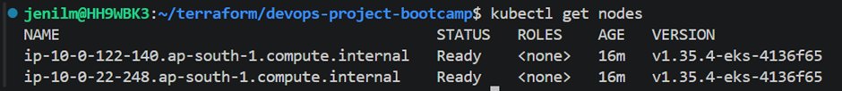

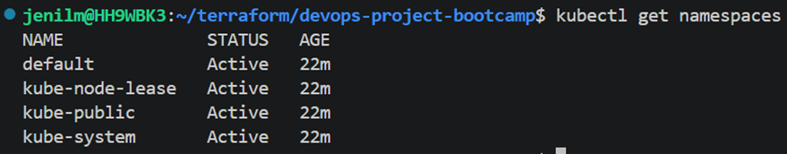

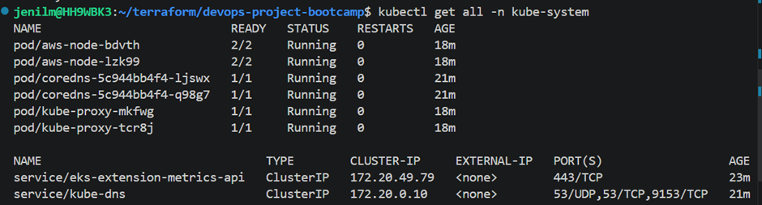
---

## Kubernetes Namespace

* Namespace is used to divide a Kubernetes cluster into separate virtual environments

---

## DaemonSet

* Ensures one copy of a pod runs on every worker node
* Used for:

  * Log collection
  * Monitoring agents
  * Security agents

---

## Kubernetes Foundation

* Kubernetes does not manage containers directly
* Pods are the smallest deployable unit in Kubernetes
* Pod acts as a wrapper around one or more containers
* Best practice:

  * One container per pod

---

## Multi-Container Pod

* One main container
* One helper/sidecar container

---

## Pod Scheduling

* Pods run on worker nodes

---

## Pod YAML Concepts

### Metadata Block

* Gives identity to pod

### Container Resources

```yaml id="kgnw11"
resources:
  limits:
  requests:
```

* `limits` → maximum resources container can consume
* `requests` → minimum guaranteed resources

---

## Readiness Probe

* Health check to verify application is ready to serve traffic

---

## Pod Commands

```bash id="s7n7t4"
kubectl apply -f catalog-pod.yaml
kubectl get pods
kubectl describe pod catalog-pod
kubectl logs -f catalog-pod
kubectl port-forward pod/catalog-pod 7080:8080
kubectl exec -it catalog-pod -- sh
kubectl delete pod catalog-pod
kubectl delete -f catalog-pod.yaml
```
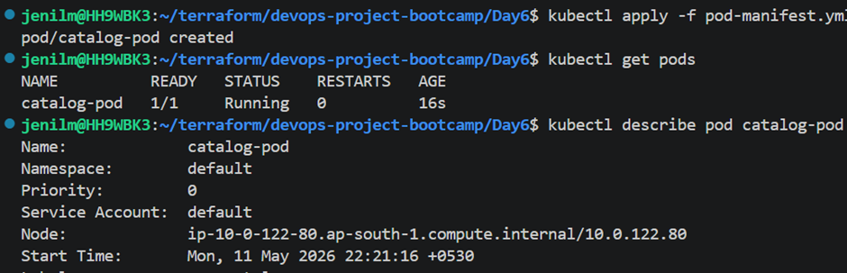

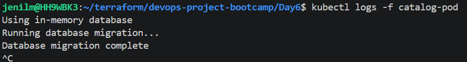

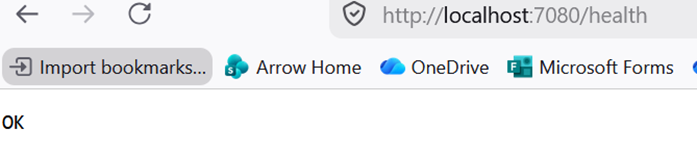

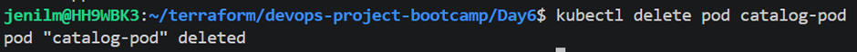
---

## Why Kubernetes Deployments?

### Reasons

* Node events
* OS upgrades
* Scaling requirements
* Resource pressure events
* High traffic periods

Without deployments:

* Pods may get deleted manually
* Manual recreation required

---

## Deployment Benefits

* Rolling updates (zero downtime)
* Self-healing
* Rollback support
* History and audit tracking
* Autoscaling with HPA

---

## Deployment + HPA

* Automatically scales pods based on:

  * CPU
  * Memory
  * Custom metrics

---

## Deployment Commands

```bash id="zcjlwm"
kubectl get deployment
kubectl get replicaset
kubectl rollout status deployment/catalog
kubectl get rs
kubectl describe rs catalog
kubectl scale deployment catalog --replicas=3
```
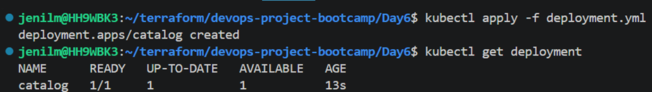

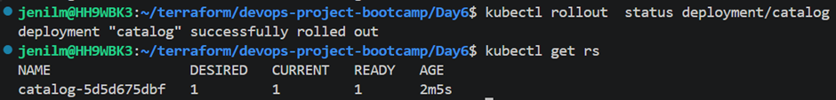

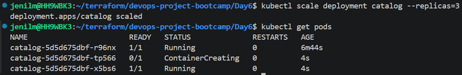
---

## Update Deployment Image

```bash id="0v8b5v"
kubectl set image deployment/catalog catalog=public.ecr.aws/aws-containers/retail-store-sample-catalog:1.3.0
```
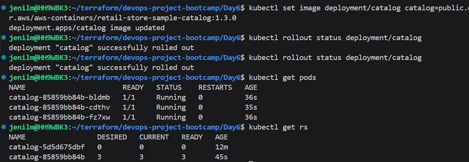
---

## Rollout Commands

```bash id="mxv70g"
kubectl rollout history deployment/catalog
kubectl rollout undo deployment/catalog
kubectl rollout undo deployment/catalog --to-revision=2
```
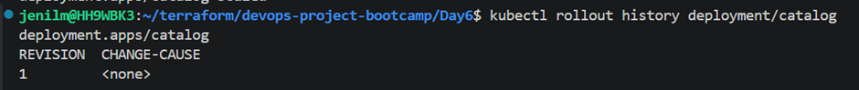

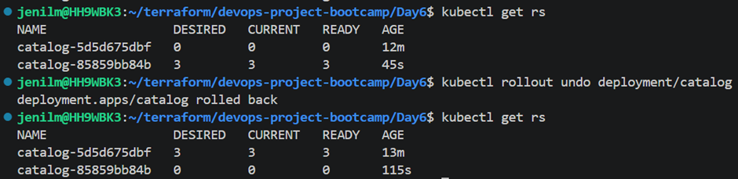

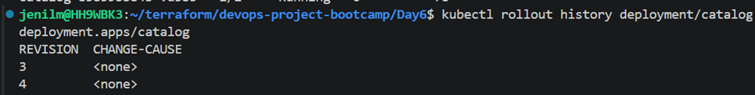
---

## ReplicaSet Concept

```text id="hf6vc9"
Deployment → ReplicaSet → Pods
```

* New version = New ReplicaSet
* Rollback = Reuse old ReplicaSet
* Provides:

  * Zero downtime
  * Stability
  * Versioning

---

## Kubernetes Service

### ClusterIP Service

* Internal communication inside Kubernetes/EKS cluster

### Service Discovery

* Uses:

  * DNS name
  * Port

### Pod Communication

* Service identifies pods using selector labels

---

## Service Commands

```bash id="9zth3n"
kubectl get deploy
kubectl get svc
kubectl get endpointslices
```
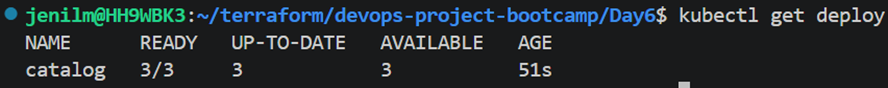

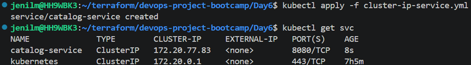

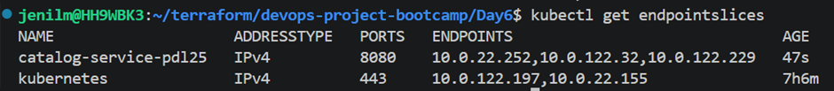
---

## Test Networking

```bash id="xg1n8p"
kubectl run test --image=curlimages/curl -it --rm -- sh
kubectl run dns-test --image=busybox:1.28 -it --rm
```
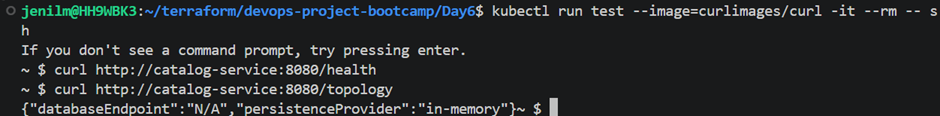

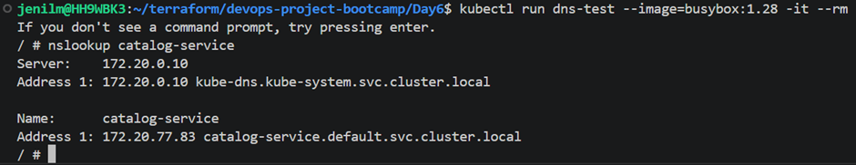
---

## Kubernetes ConfigMap

* Stores configuration in key-value format
* Helps reuse deployment templates across environments

### Benefits

* Avoid hardcoding environment variables in deployment YAML
* Centralized configuration management

---

## ConfigMap Command

```bash id="3g1n7v"
kubectl get cm
```
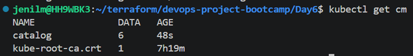

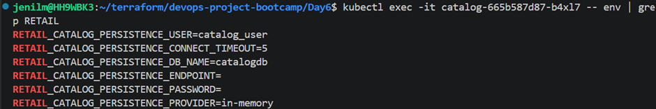
---
