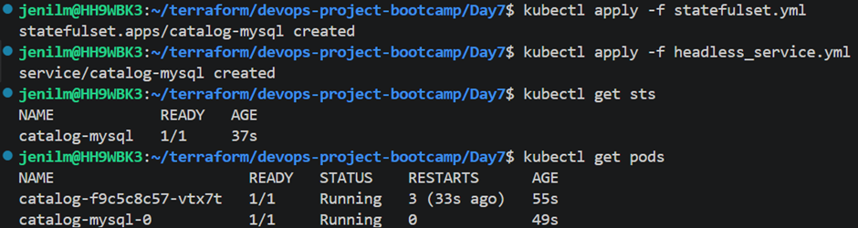
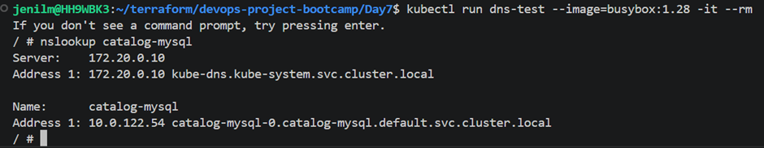
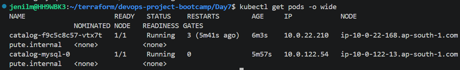
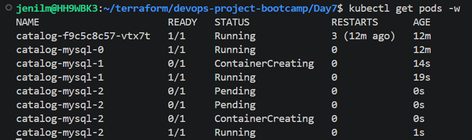
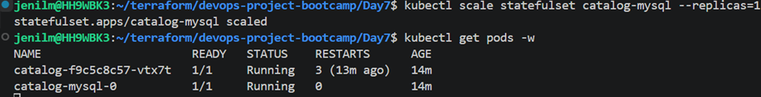
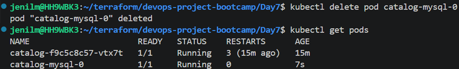
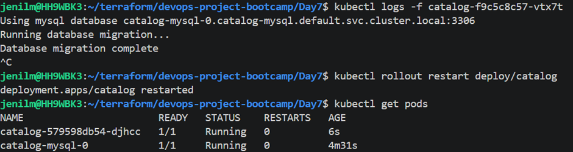
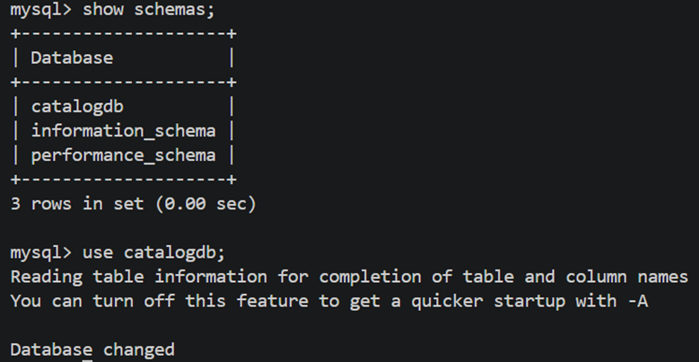

## Kubernetes StatefulSets

### Stateful Applications

Examples:

* MySQL
* Redis
* PostgreSQL

These applications require:

* Stable identity
* Stable storage
* Stable networking

---

## Master-Slave Architecture

### Single Master

* Accepts read and write operations

### Multiple Slaves

* Read-only replicas

### Replication

* Slaves continuously replicate data from master
* Slaves require master host information

---

## Problem with Normal Pods

* Pod names are dynamic
* If master pod crashes:

  * Kubernetes recreates pod
  * Pod name changes
  * Slave replication breaks

---

## StatefulSet Features

### Stable Pod Identity

* Recreated pods get same name

### Ordered Pod Creation

* Pods start sequentially

### Ordered Pod Deletion

* Pods delete in reverse order

---

## Why Not ClusterIP Service?

### ClusterIP Works If

* Only one master exists

### Problem

* If master crashes:

  * Pod IP changes
  * DNS name changes
  * Applications lose connectivity

---

## Headless Service

### Features

* No load balancing
* Creates DNS entry for each pod

### DNS Format

```text id="0plfmu"
podname.headless-service.namespace.svc.cluster-domain.example
```

### Configuration

```yaml id="8n4k5m"
clusterIP: None
```

---

## StatefulSet Commands

```bash id="mk4vm1"
kubectl get sts
kubectl run dns-test --image=busybox:1.28 -it --rm
nslookup catalog-mysql
```





---

## Scale StatefulSet

### Ordered Pod Creation

```bash id="lq72lj"
kubectl scale statefulset catalog-mysql --replicas=3
kubectl get pods -w
```



---

## Delete Pod

```bash id="mll83j"
kubectl delete pod catalog-mysql-0
```




* StatefulSet recreates pod with same identity

---

## Important Note

* StatefulSet provides:

  * Stable identity
  * Stable networking
  * Stability

* Replication logic must still be configured manually

---

## MySQL Client Access

```bash id="lhzzdw"
kubectl run mysql-client --rm -it \
  --image=mysql:8.0 \
  --restart=Never \
  -- mysql -h catalog-mysql -u catalog_user -p
```

---
