## Kubernetes Secrets

### View Secrets

```bash  id="p8x7dq"
kubectl get secret
```
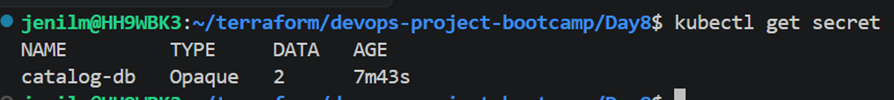
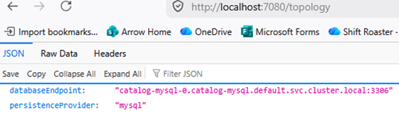
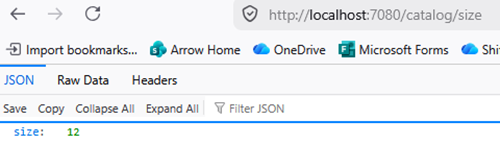
---

## Secret Type: Opaque

* Default Kubernetes secret type
* Stores arbitrary key-value data

---

## Pod Identity Agent (PIA)

### How EKS Pods Access AWS Services

Using:

1. AWS IAM Role
2. EKS Pod Identity Agent (DaemonSet Add-on)
3. Kubernetes Service Account
4. EKS Pod Identity Association

---

## Why Service Account is Needed

* Service Account acts as identity for pods/applications inside Kubernetes

### Without Service Account

* Kubernetes cannot determine which IAM role pod should use

---

## Install EKS Pod Identity Agent

* Add Amazon EKS Pod Identity Agent from EKS add-ons

### Verify DaemonSet

```bash id="c9h0zv"
kubectl get ds -n kube-system
```
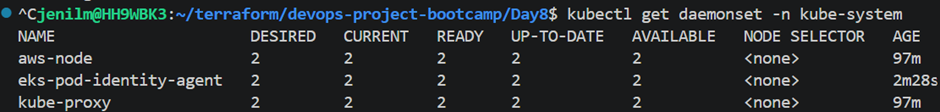

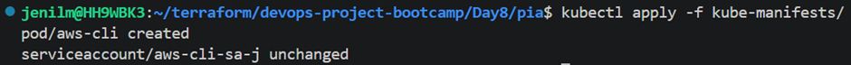
---

## Service Accounts

```bash id="ggzh2m"
kubectl get sa
```

---

## Test AWS Access from Pod

```bash id="k6r1o8"
kubectl exec -it aws-cli -- aws s3 ls
```
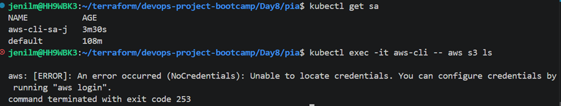
---

## Create IAM Role for PIA

```bash id="fkm7kr"
kubectl delete pod aws-cli -n default
```
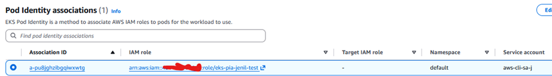
---

## Kubernetes Secrets vs AWS Secrets Manager

### Kubernetes Secrets

* Stored inside etcd
* Base64 encoded only
* Kubernetes admins can access and decode

### AWS Secrets Manager

* Encrypted securely
* Access control support
* Secret rotation support

---

## Important Concepts

### Service Account

* Pod identity inside Kubernetes

### EKS PIA DaemonSet

* Credential provider bridge running on every node

---

## AWS Secrets Manager Integration

### Components

#### 1. Secrets Store CSI Driver

* Kubernetes CSI plugin
* Mounts secrets/certificates from external providers

#### 2. AWS Secrets and Configuration Provider (ASCP)

* Retrieves secrets from AWS Secrets Manager

---

## Benefits of Pod Identity Agent

* No need to manually manage:

  * OIDC providers
  * IAM role annotations

---

## CRD - Custom Resource Definition

### SecretProviderClass

* Defines how external secrets are accessed in Kubernetes

---

## Why Helm?

* Used to install:

  * Secrets Store CSI Driver
  * AWS Secrets and Configuration Provider (ASCP)

---

## Helm Concepts

### Helm Chart Structure

* Templates
* Values

### Helm Benefits

* Reusability
* Versioning
* Release management
* Packaging and sharing
* Simplified deployments
* Consistency
* Helm repositories

---

## Helm Commands

```bash id="e9u4sm"
helm version
helm repo update
helm repo list
```
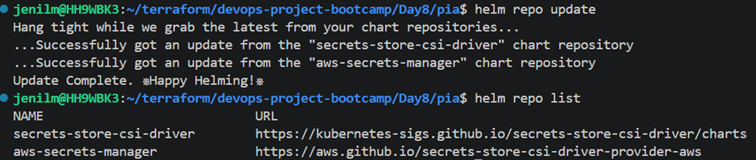
---

## Install Secrets Store CSI Driver

```bash id="hmll4z"
helm install csi-secrets-store \
  secrets-store-csi-driver/secrets-store-csi-driver \
  --namespace kube-system \
  --set tokenRequests[0].audience="pods.eks.amazonaws.com"
```

---

## Verify Helm Installation

```bash id="m7v7up"
helm list --all-namespaces
helm list -n kube-system
helm status csi-secrets-store -n kube-system
```
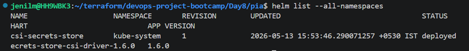
---

## Install AWS Secrets and Configuration Provider (ASCP)

```bash id="sz0r5v"
helm install secrets-provider-aws \
  aws-secrets-manager/secrets-store-csi-driver-provider-aws \
  --namespace kube-system \
  --set secrets-store-csi-driver.install=false
```

---

## Verify ASCP Installation

```bash id="c2c0ne"
helm status secrets-provider-aws -n kube-system
kubectl get pods -n kube-system -l app=secrets-store-csi-driver-provider-aws
```
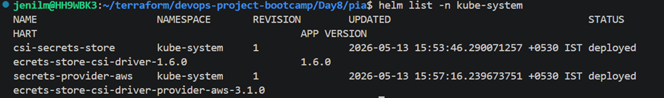

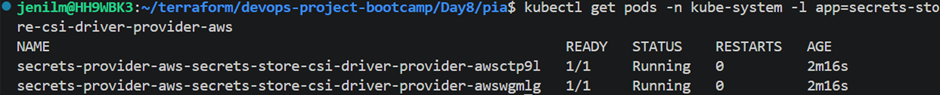
---

## Create IAM Policy

* Create IAM policy for accessing AWS Secrets Manager

---

## AWS Secrets Manager Commands

```bash id="ydw1fc"
aws secretsmanager list-secrets \
  --region $AWS_REGION \
  --query "SecretList[?contains(Name, 'catalog-db-secret-1')].[Name,ARN]" \
  --output table
```

---

## Secret Mounting Concept

* Volumes bring secrets into pod
* Volume mounts make secrets available inside containers
* Arguments section securely injects secrets into application

---

## EKS Pod Identity Association

```bash id="w7vty4"
aws eks list-pod-identity-associations --cluster-name ${EKS_CLUSTER_NAME}
```
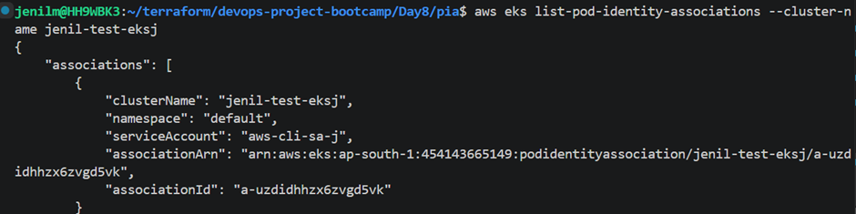

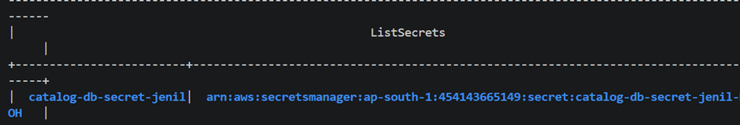
---

## SecretProviderClass

```bash id="ykj2rw"
kubectl get secretproviderclass
```
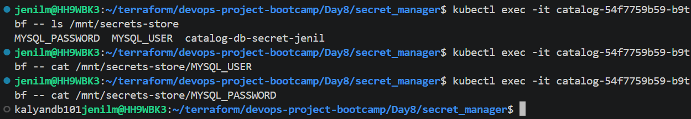
---
