## AWS EBS in Kubernetes

### Why AWS EBS?

* `emptyDir` → temporary storage, When pod gets deleted or recreated, data is lost
* `EBS CSI` → persistent storage, Data remains even if pod restarts or moves

---

## CSI - Container Storage Interface

* Standard interface for storage integration in Kubernetes
* Allows Kubernetes to communicate with storage systems like:
AWS EBS,
Azure Disk,
GCP Persistent Disk

---

## Persistent Storage Components

### PVC - Persistent Volume Claim

* Request for storage by application/pod

### PV - Persistent Volume

* Actual storage resource provisioned in cluster

### StorageClass

* Defines how storage should be created
* Example:

  * `gp2`
  * `gp3`

---

## Resource Scope

### Cluster Scoped

* PV
* StorageClass

### Namespace Scoped

* PVC

---

## EBS CSI Driver Components
AWS EBS integration in Kubernetes works using EBS CSI Driver.

### 1. EBS CSI Node

* Runs as DaemonSet on every worker node
* Responsible for:

  * Mounting volumes
  * Unmounting volumes

---

### 2. EBS CSI Controller

* Runs as Kubernetes Deployment
* Handles:

  * Volume provisioning
  * Attach/Detach operations

---

### 3. ebs-csi-controller-sa

* Service Account used for authentication
* Uses EKS Pod Identity to access AWS EBS APIs

---

## Environment Variables

```bash id="n0jjlwm"
export AWS_REGION="<aws-region>"
export EKS_CLUSTER_NAME="<eks-cluster-name>"
export AWS_ACCOUNT_ID=$(aws sts get-caller-identity --query Account --output text)
```

---

## Create IAM Role

### Trust Policy File

```text id="cy9twj"
ebs-csi-driver-trust-policy.json
```

### Create Role

```bash id="5rl14z"
aws iam create-role \
  --role-name AmazonEKS_EBS_CSI_DriverRole_${EKS_CLUSTER_NAME} \
  --assume-role-policy-document file://ebs-csi-driver-trust-policy.json
```

---

## Attach IAM Policy

```bash id="rmtut9"
aws iam attach-role-policy \
  --role-name AmazonEKS_EBS_CSI_DriverRole_${EKS_CLUSTER_NAME} \
  --policy-arn arn:aws:iam::aws:policy/service-role/AmazonEBSCSIDriverPolicy
```

---

## Verify Attached Policies

```bash id="6k7lq5"
aws iam list-attached-role-policies \
  --role-name AmazonEKS_EBS_CSI_DriverRole_${EKS_CLUSTER_NAME}
```

---

## EKS Pod Identity Association
Associates:

* IAM Role
* Kubernetes Service Account
* Namespace

This allows Kubernetes workloads to securely access AWS APIs.

## Create EKS Pod Identity Association

```bash id="o2u29m"
aws eks create-pod-identity-association \
  --cluster-name ${EKS_CLUSTER_NAME} \
  --namespace default \
  --service-account <service-account-name> \
  --role-arn arn:aws:iam::<aws-account-id>:role/AmazonEKS_EBS_CSI_DriverRole_${EKS_CLUSTER_NAME}
```

---

## Verify EKS Add-ons

```bash id="p28gn9"
aws eks list-addons --cluster-name ${EKS_CLUSTER_NAME}
```
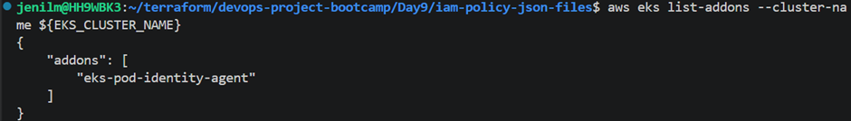
---

## Install EKS EBS CSI Add-on

```bash id="96wbyh"
aws eks create-addon \
  --cluster-name ${EKS_CLUSTER_NAME} \
  --addon-name aws-ebs-csi-driver \
  --service-account-role-arn arn:aws:iam::<aws-account-id>:role/AmazonEKS_EBS_CSI_DriverRole_${EKS_CLUSTER_NAME}
```
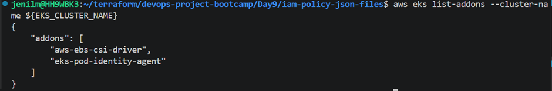
---

## Verify Add-on Status

```bash id="5vjlwm"
aws eks describe-addon \
  --cluster-name ${EKS_CLUSTER_NAME} \
  --addon-name aws-ebs-csi-driver \
  --query "addon.status" --output text
```
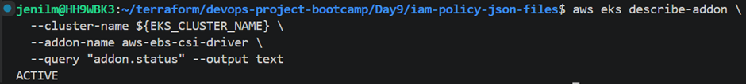
---

## Verify CSI Pods

```bash id="f5nvc0"
kubectl get pods -n kube-system | grep ebs-csi
```
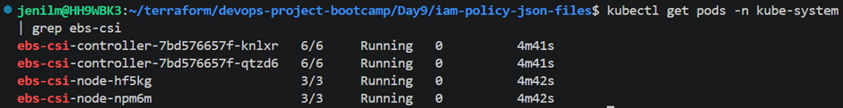

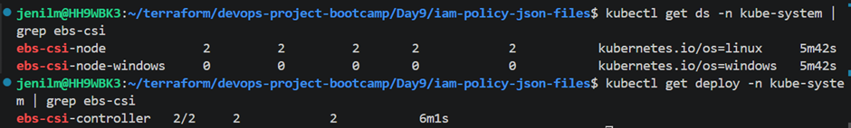
---

## Verify Storage Resources

```bash id="z67e11"
kubectl get pvc
kubectl get pv
```
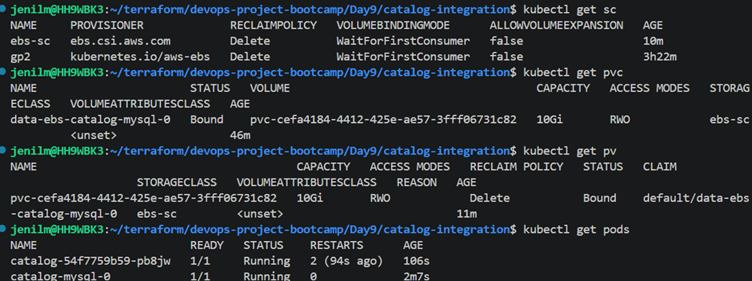
---

## Access Application

```bash id="g8h2tt"
kubectl port-forward svc/<service-name> 7080:8080
```
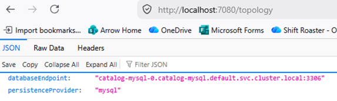

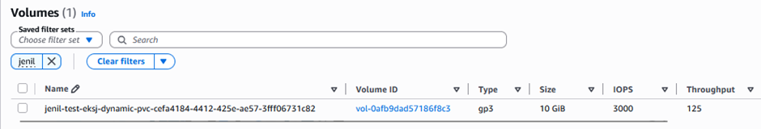

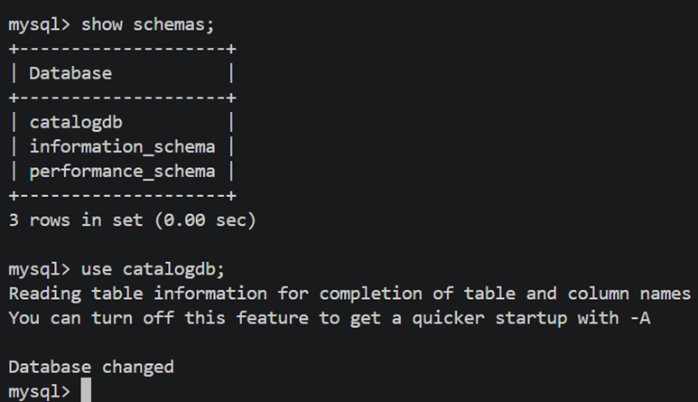

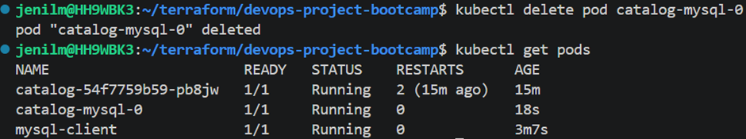

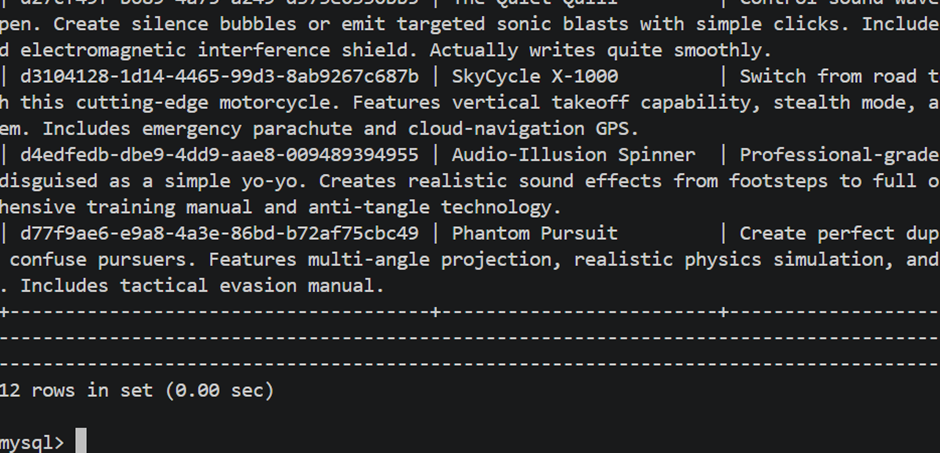

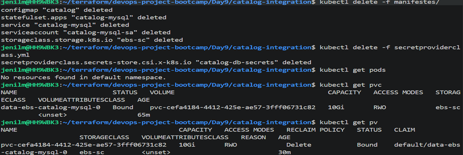
---

## Delete PVC

```bash id="3v9q8z"
kubectl delete pvc <pvc-name>
```
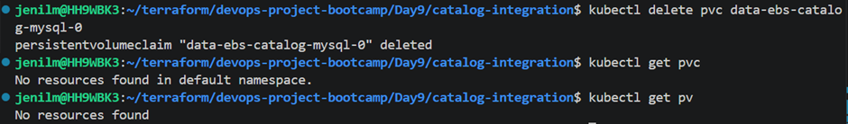
---

# AWS RDS

## Why AWS RDS?

### Challenges with StatefulSets + Database

* Database backups
* Patching
* Replication
* High availability
* Recovery management

---

## Get EKS Cluster Security Group

```bash id="x5r3nj"
aws eks describe-cluster \
  --name <eks-cluster-name> \
  --query "cluster.resourcesVpcConfig.clusterSecurityGroupId" \
  --output text
```

---

## Connect to RDS

```bash id="evqq1x"
kubectl run mysql-client --rm -it \
  --image=mysql:8.0 \
  --restart=Never \
  -- mysql -h <rds-endpoint> -u <db-username> -p
```
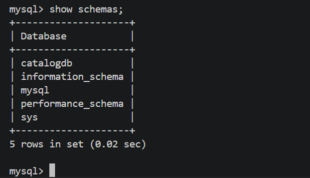

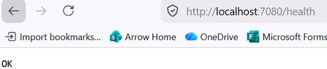

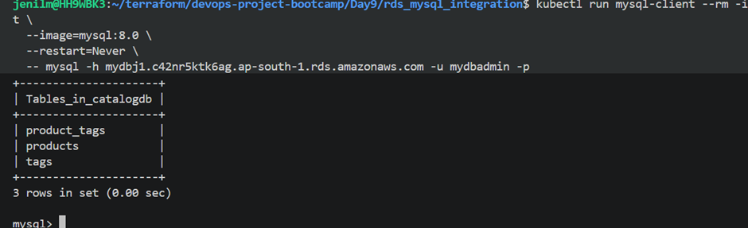

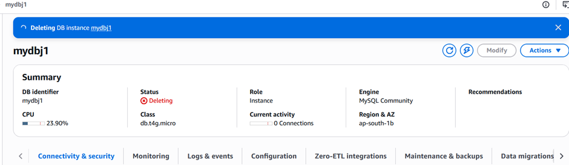
---